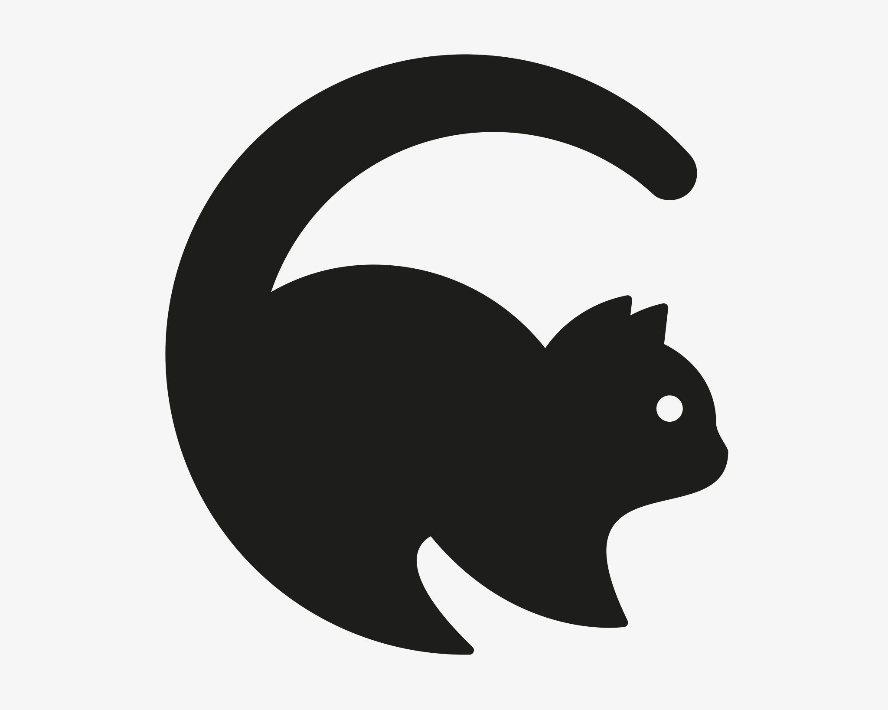

<!-- PROJECT SHIELDS -->
<!--
*** I'm using markdown "reference style" links for readability.
*** Reference links are enclosed in brackets [ ] instead of parentheses ( ).
*** See the bottom of this document for the declaration of the reference variables
*** for contributors-url, forks-url, etc. This is an optional, concise syntax you may use.
*** https://www.markdownguide.org/basic-syntax/#reference-style-links
-->

[![Contributors][contributors-shield]][contributors-url]
[![Forks][forks-shield]][forks-url]
[![Stargazers][stars-shield]][stars-url]
[![Issues][issues-shield]][issues-url]
[![MIT License][license-shield]][license-url]
[![Quality Gate Status][sonarcloud-shield]][sonarcloud-url]
[![Renovate][renovate-shield]][renovate-url]
[![Netlify][netlify-shield]][netlify-url]

<!-- PROJECT LOGO -->
<br />
<p align="center">
  <a href="https://github.com/MeStrak/catkin">
    
  </a>

  <h3 align="center">Catkin</h3>

  <p align="center">
    An open source agile tool that's actually good.
    <br />
    <br />
    <a href="https://www.catkin.dev">View Demo</a>
    ·
    <a href="https://github.com/MeStrak/catkin/issues">Report Bug</a>
    ·
    <a href="https://github.com/MeStrak/catkin/issues">Request Feature</a>
  </p>
</p>

<!-- TABLE OF CONTENTS -->

## Table of Contents

- [Table of Contents](#table-of-contents)
- [About The Project](#about-the-project)
  - [Built With](#built-with)
- [Getting Started](#getting-started)
  - [Prerequisites](#prerequisites)
  - [Installation](#installation)
- [Usage](#usage)
- [Roadmap](#roadmap)
- [Contributing](#contributing)
- [License](#license)
- [Contact](#contact)
- [Acknowledgements](#acknowledgements)

<!-- ABOUT THE PROJECT -->

## About The Project

[![Product Name Screen Shot][product-screenshot]](https://catkin.dev)

Our aim is to make a fast, easy to use agile workflow too focused on ensuring high quality user stories.

- Persona tagging -the novelty of 'As a xxxxx I want to' has warn off
- User story quality checks - liting to make sure user stories are written in the expected format (coming soon!)
- User story rating system - devs can vote on the most useful stories (coming soon!)

### Built With

- [nest.js](https://nestjs.com)
- [vue.js](https://vuejs.org)
- [vuetify](https://vuetifyjs.com)

<!-- GETTING STARTED -->

## Getting Started

To get a local copy or your own server up and running follow these steps.

### Prerequisites

- Install Yarn from https://yarnpkg.com
- Create an Auth0 account and application, you'll use the KPI key in Catkin configuration

### Installation

1. Clone the repo

```sh
git clone https://github.com/MeStrak/catkin.git
```

2. Install packages
   In both frontend and backend folders:

```sh
yarn
```

3. Setup frontend .env file
   Copy template.env and rename as .env (you can use .env.development, .env.production according to vue.js .env naming conventions)

For a local development environment assuming you use default nest.js ports.

```
VUE_APP_GRAPHQL_HTTP = 'http://localhost:3000/graphql'
VUE_APP_GRAPHQL_WS= 'ws://localhost:3000/graphql'
VUE_APP_AUTH0_CLIENT_ID = from Auth0
VUE_APP_AUTH0_DOMAIN = from Auth0 config
VUE_APP_AUTH0_REDIRECT = http://localhost:8080/callback (to be added to Auth0 app allowed callback URLs)
VUE_APP_AUTH0_SCOPE = full_access
VUE_APP_AUTH0_AUDIENCE = from Auth0 config (your domain name)
```

For deployed environments, localhost addresses should be updated to the server or domain name.

4. Setup backend .env file

```
AUTH0_DOMAIN=from Auth0 config
AUTH0_AUDIENCE=https://catkin.dev
MONGO_CONNECTION=configure for your mongodb server, template format provided in template.env file
```

<!-- USAGE EXAMPLES -->

## Usage

Catkin can be used by agile dev teams and other types of project. With a bit more work and some kind contributors hopefully it can challenge Trello for usability and beat Jira for useful functionality.

<!-- ROADMAP -->

## Roadmap

Check implementation progress directly in the demo website where the backlog is prioritised.

Major features that we plan to implement once the basic app is stable:

- User story linting
- User story rating
- Specifications
- Organisations
- Board permissions

<!-- CONTRIBUTING -->

## Contributing

Contributions are what make the open source community such an amazing place to be learn, inspire, and create. Any contributions you make are **greatly appreciated**.

1. Fork the Project
2. Create your Feature Branch (`git checkout -b feature/AmazingFeature`)
3. Commit your Changes (`git commit -m 'Add some AmazingFeature'`)
4. Push to the Branch (`git push origin feature/AmazingFeature`)
5. Open a Pull Request

<!-- LICENSE -->

## License

Distributed under the MIT License. See `LICENSE` for more information.

<!-- CONTACT -->

## Contact

Project Link: [https://github.com/MeStrak/catkin](https://github.com/MeStrak/catkin)

<!-- ACKNOWLEDGEMENTS -->

## Acknowledgements

- [vue-kanban](https://github.com/BrockReece/vue-kanban)
- [Kamil Mysliwec (nest.js creator)](https://github.com/kamilmysliwiec)
- [Gabriel Tanner's article used to get a headstart on nest.js backend dev](https://medium.com/better-programming/building-a-graphql-server-in-nestjs-f9ba34e773a3)

<!-- MARKDOWN LINKS & IMAGES -->
<!-- https://www.markdownguide.org/basic-syntax/#reference-style-links -->

[contributors-shield]: https://img.shields.io/github/contributors/MeStrak/catkin.svg?style=flat-square
[contributors-url]: https://github.com/MeStrak/catkin/graphs/contributors
[forks-shield]: https://img.shields.io/github/forks/MeStrak/catkin.svg?style=flat-square
[forks-url]: https://github.com/MeStrak/catkin/network/members
[stars-shield]: https://img.shields.io/github/stars/MeStrak/catkin.svg?style=flat-square
[stars-url]: https://github.com/MeStrak/catkin/stargazers
[issues-shield]: https://img.shields.io/github/issues/MeStrak/catkin.svg?style=flat-square
[issues-url]: https://github.com/MeStrak/catkin/issues
[license-shield]: https://img.shields.io/badge/License-MIT-green.svg
[license-url]: https://github.com/MeStrak/catkin/blob/master/LICENSE
[product-screenshot]: images/screenshot.png
[sonarcloud-shield]: https://sonarcloud.io/api/project_badges/measure?project=MeStrak_catkin&metric=alert_status
[sonarcloud-url]: https://sonarcloud.io/dashboard?id=MeStrak_catkin
[renovate-shield]: https://img.shields.io/badge/renovate-enabled-brightgreen.svg
[renovate-url]: https://renovatebot.com
[netlify-shield]: https://img.shields.io/netlify/484e088b-07df-469b-8ccf-69d0fae6d59d
[netlify-url]: https://www.catkin.dev
